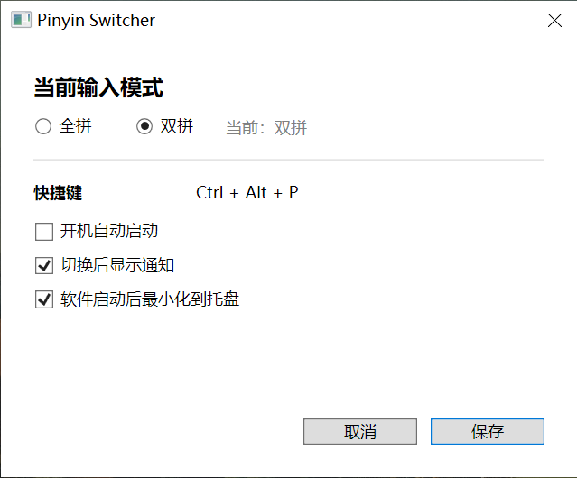

# PinyinSwitcher

PinyinSwitcher 是一个常驻 Windows 托盘的微软拼音模式切换工具，用于在全拼和双拼之间快速切换。项目基于 .NET Framework 4.8 与 WPF，不依赖第三方运行库。

## 功能

- 自动读取微软拼音当前的全拼/双拼状态。
- 托盘图标使用「全」「双」直观显示当前模式。
- 通过托盘菜单切换全拼、双拼。
- 使用全局快捷键 <code>Ctrl + Alt + P</code> 快速切换。
- 支持切换完成通知、开机启动和启动后最小化。
- 单实例运行，避免产生重复托盘图标。

## 软件界面

<!--
添加正式截图后，可将下面的占位块替换为：

-->

~~~text
┌──────────────────────────────────────────────────────────────┐
│                                                              │
│                     软件界面截图预留位                       │
│                                                              │
│          建议截图路径：docs/images/main-window.png           │
│                                                              │
└──────────────────────────────────────────────────────────────┘
~~~

## 运行要求

- Windows 10 或 Windows 11（x64）。
- 已安装并启用微软拼音输入法。
- .NET Framework 4.8。

程序只修改当前用户的微软拼音和开机启动配置，不需要管理员权限。

## 构建

使用 Visual Studio 2022 打开 <code>PinyinSwitcher.sln</code>，选择 <code>Release | Any CPU</code> 后构建。

也可以在 Visual Studio Developer PowerShell 中运行：

~~~powershell
msbuild PinyinSwitcher.sln /t:Build /p:Configuration=Release
~~~

生成的主程序位于：

~~~text
bin\Release\PinyinSwitcher.exe
~~~

## 使用

1. 运行 <code>PinyinSwitcher.exe</code>。
2. 右键托盘图标选择「全拼」或「双拼」，也可以按 <code>Ctrl + Alt + P</code> 快速切换。
3. 双击托盘图标可打开设置窗口。
4. 需要完全退出时，使用托盘菜单中的「退出」。

托盘状态对应关系：

| 微软拼音模式 | 托盘图标 | Tooltip |
| --- | --- | --- |
| 全拼 | 全 | <code>Pinyin Switcher - 全拼</code> |
| 双拼 | 双 | <code>Pinyin Switcher - 双拼</code> |

模式切换成功后才会更新托盘状态。如果注册表已经更新但 IME 刷新广播失败或超时，程序会显示警告。

## 配置与日志

| 内容 | 路径 |
| --- | --- |
| 用户配置 | <code>%APPDATA%\PinyinSwitcher\config.json</code> |
| 运行日志 | <code>%LOCALAPPDATA%\PinyinSwitcher\logs\yyyy-MM-dd.log</code> |
| 开机启动 | 当前用户注册表 <code>Software\Microsoft\Windows\CurrentVersion\Run</code> |

## 开发工具

<code>PinyinSpike</code> 是项目自带的开发诊断程序，可执行模式读写自检以及重新生成托盘图标。

重新生成 <code>Resources\full.ico</code> 和 <code>Resources\double.ico</code>：

~~~powershell
msbuild PinyinSpike\PinyinSpike.csproj /t:Build /p:Configuration=Release
PinyinSpike\bin\Release\PinyinSpike.exe --generate-tray-icons
~~~

图标生成只用于开发阶段。正式程序直接加载程序集中的静态 ICO 资源，不会在运行时绘制图标。

## 项目结构

~~~text
PinyinSwitcher/
├── Models/                  数据模型与拼音模式
├── Resources/               全拼/双拼托盘图标
├── Services/                拼音、托盘、热键、配置等服务
├── Tools/                   开发期托盘图标生成器
├── Utils/                   日志工具
├── PinyinSpike/             开发诊断控制台
├── MainWindow.xaml          设置窗口
└── PinyinSwitcher.sln       Visual Studio Solution
~~~

## 常见问题

### 提示未检测到微软拼音

先在 Windows「语言和区域」设置中安装并启用微软拼音，然后重新启动程序。

### 快捷键不可用

<code>Ctrl + Alt + P</code> 可能已被其他程序占用。仍可通过托盘菜单切换，并可在日志中查看快捷键注册失败记录。

### 注册表已更新，但输入法没有立即切换

Windows 的 IME 刷新广播可能失败或超时。切换一次输入焦点或重启相关应用后再检查；错误详情会写入运行日志。
